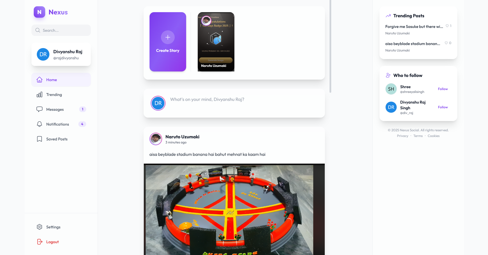
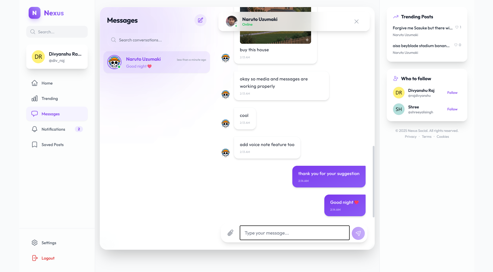
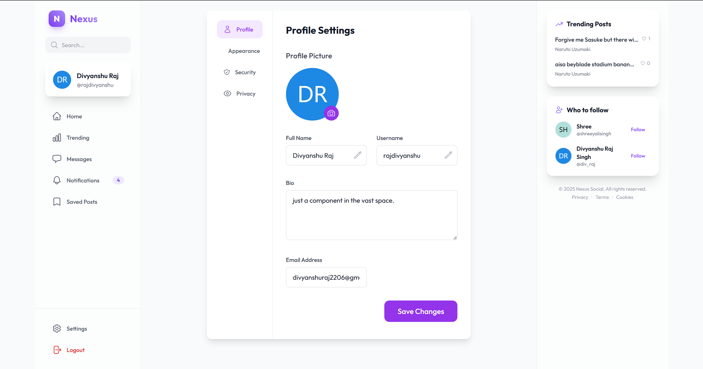
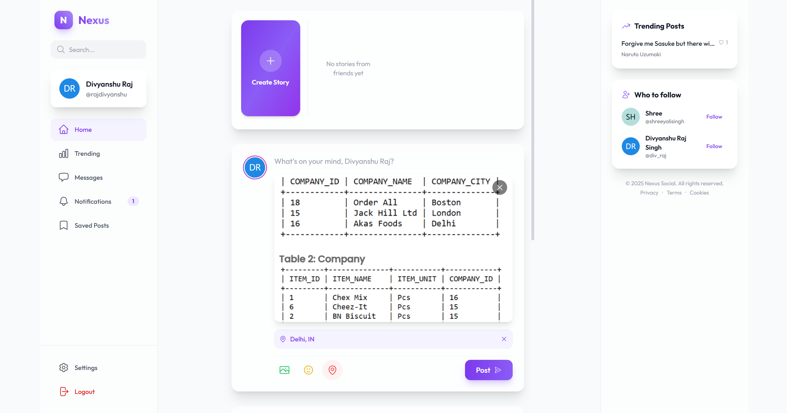
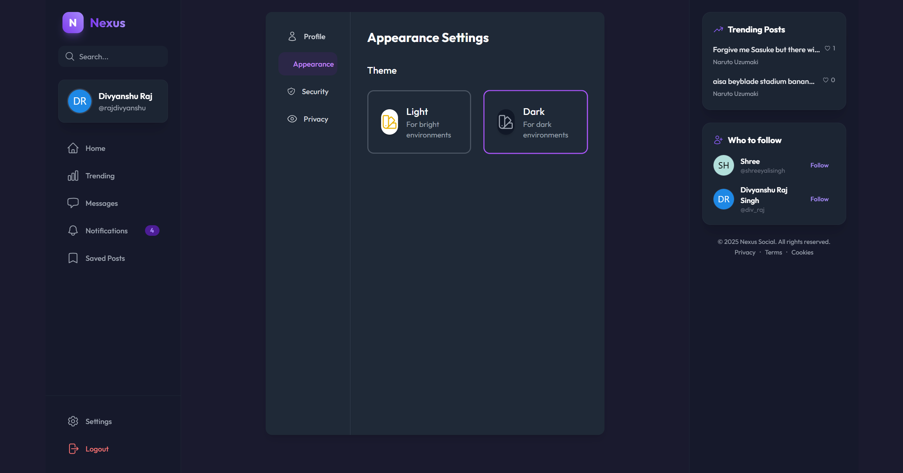
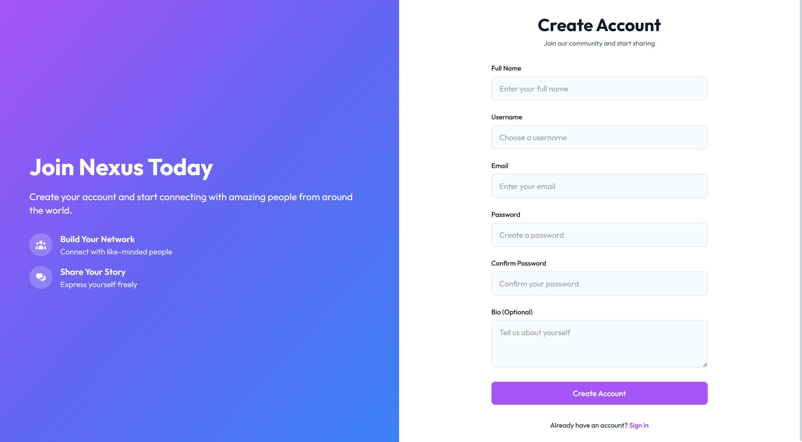
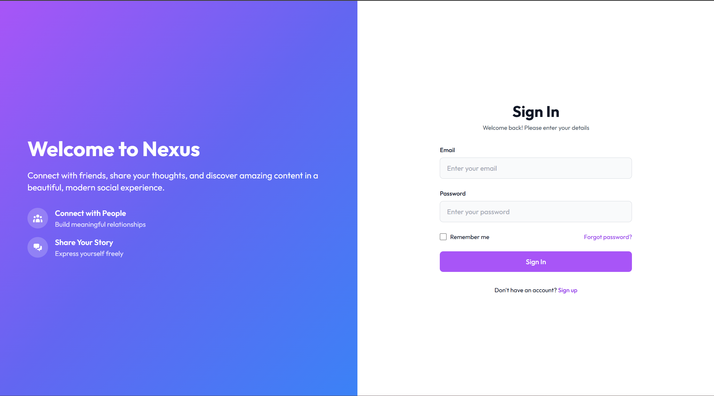

# Nexus Social App

<p align="center">
  
</p>

<p align="center">
  <a href="#">
    
  </a>
  <a href="https://github.com/divyanshu02raj/Nexus-Social-App">
    
  </a>
  <a href="https://github.com/divyanshu02raj/Nexus-Social-App/stargazers">
    
  </a>
  <a href="https://github.com/divyanshu02raj/Nexus-Social-App/network/members">
    
  </a>
</p>

<p align="center">
  
  
  
  
  
  
  
</p>

<p align="center">
  
  
</p>


<p align="center">
  A next-generation social media platform built on the MERN stack. Nexus features a stunning glassmorphic UI, real-time messaging, ephemeral stories, and a robust social graph, designed to connect people in a modern, engaging environment.
</p>

---

## Table of Contents
- [Demo](#demo)
- [Key Features](#key-features)
- [Technology Stack](#technology-stack)
- [Getting Started](#getting-started)
- [Screenshots](#screenshots)
- [Future Work](#future-work)
- [Contributing](#contributing)
- [Acknowledgments](#acknowledgments)
- [Contact](#contact)

---

## Demo

* **Live Deployed Site:** [https://nexus-social-app.vercel.app/](https://nexus-social-app.vercel.app/)
* **GitHub Repository:** [https://github.com/divyanshu02raj/Nexus-Social-App](https://github.com/divyanshu02raj/Nexus-Social-App)

---

## Key Features

Nexus provides a comprehensive social experience with a focus on aesthetics, performance, and real-time interaction.

* **Modern & Premium UI:**
    * **Glassmorphism Design:** A visually striking interface using frosted glass effects, vibrant gradients, and smooth **Framer Motion** animations.
    * **Responsive Layout:** A 3-column layout that adapts seamlessly to all screen sizes, featuring a dedicated sidebar for navigation and trending content.
* **Real-Time Communication:**
    * **Instant Messaging:** Built with **Socket.IO**, allowing users to chat in real-time with typing indicators and online status updates.
    * **Media Sharing:** Users can share images directly within chats, powered by **Cloudinary**.
* **Social Interaction:**
    * **Posts & Feed:** Create rich posts with images, captions, and location tags. Interact with content through likes, comments, and saving posts.
    * **Stories:** Share ephemeral moments that disappear after 24 hours. Includes view counting and liking features.
    * **Follow System:** A robust follow/unfollow mechanism with support for **Private Accounts** and follow requests.
* **Discovery & Trending:**
    * **Trending Feed:** Real-time algorithm to highlight the most popular posts and discussions.
    * **Suggested Users:** Intelligent recommendations for "Who to follow" based on network connections.
    * **Location Services:** Integrated **OpenStreetMap** for location tagging and autocomplete in posts and profiles.
* **Security & Privacy:**
    * **Secure Auth:** JWT-based authentication with encrypted passwords and secure cookie management.
    * **Private Profiles:** Users can toggle their account to private, requiring approval for new followers.

---

## Technology Stack

The project utilizes a modern MERN stack with a decoupled frontend and backend architecture.

| Category | Technology |
| :--- | :--- |
| **Frontend** | `React`, `Redux Toolkit`, `Tailwind CSS`, `Framer Motion`, `Socket.IO Client`, `Axios` |
| **Backend** | `Node.js`, `Express.js`, `Socket.IO`, `JWT` |
| **Database** | `MongoDB` with `Mongoose` |
| **Services** | `Cloudinary` (Media Storage), `OpenStreetMap` (Location Data) |
| **Deployment**| Frontend on **Vercel**, Backend on **Render** |

---

## Getting Started

To get a local copy up and running, please follow these steps.

### Prerequisites

* Node.js (v18 or newer recommended)
* npm (or yarn)
* A MongoDB database instance (local or MongoDB Atlas)
* A Cloudinary account for image storage

### Installation & Setup

1.  **Clone the Repository:**
    ```bash
    git clone https://github.com/divyanshu02raj/Nexus-Social-App.git
    cd Nexus-Social-App
    ```

2.  **Backend Setup:**
    * Navigate to the backend directory:
        ```bash
        cd backend
        ```
    * Install dependencies:
        ```bash
        npm install
        ```
    * Create a `.env` file and populate it with your keys:
        ```env
        PORT=8000
        MONGODB_URI=your_mongodb_connection_string
        JWT_SECRET=your_super_secret_jwt_key
        FRONTEND_URL=http://localhost:5173
        CLOUDINARY_CLOUD_NAME=your_cloud_name
        CLOUDINARY_API_KEY=your_api_key
        CLOUDINARY_API_SECRET=your_api_secret
        ```
    * Start the backend server:
        ```bash
        npm run server
        ```

3.  **Frontend Setup:**
    * Open a new terminal and navigate to the frontend directory:
        ```bash
        cd frontend
        ```
    * Install dependencies:
        ```bash
        npm install
        ```
    * Create a `.env` file and add the following variables:
        ```env
        VITE_API_URL=http://localhost:8000
        ```
    * Start the frontend development server:
        ```bash
        npm run dev
        ```

---

## Screenshots

<table>
  <tr>
    <td align="center" width="50%">
      <b>Home Feed</b><br>
      <i>The main feed with glassmorphic posts and stories.</i><br><br>
      
    </td>
    <td align="center" width="50%">
      <b>Chat Interface</b><br>
      <i>Real-time messaging with media support.</i><br><br>
      
    </td>
  </tr>
  
  <tr>
    <td align="center">
      <b>User Profile</b><br>
      <i>Profile page with posts, bio, and stats.</i><br><br>
      
    </td>
    <td align="center">
      <b>Settings Dashboard</b><br>
      <i>Manage account, security, and privacy.</i><br><br>
      
    </td>
  </tr>

  <tr>
    <td align="center">
      <b>Create Post</b><br>
      <i>Rich text editor with image and location support.</i><br><br>
      
    </td>
    <td align="center">
      <b>Dark Mode</b><br>
      <i>Sleek dark theme for low-light usage.</i><br><br>
      
    </td>
  </tr>

  <tr>
    <td align="center">
      <b>Sign Up</b><br>
      <i>Modern onboarding experience.</i><br><br>
      
    </td>
    <td align="center">
      <b>Login</b><br>
      <i>Secure authentication entry point.</i><br><br>
      
    </td>
  </tr>
</table>

---

## 📂 Project Structure

```bash
Nexus-Social-App/
├── backend/                 # Node.js & Express Backend
│   ├── config/             # Database & Cloudinary Config
│   ├── controllers/        # Route Controllers
│   ├── middleware/         # Auth & Error Middleware
│   ├── models/             # Mongoose Models
│   ├── routes/             # API Routes
│   └── server.js           # Entry Point
│
└── frontend/               # React Frontend
    ├── public/             # Static Assets
    ├── src/
    │   ├── components/     # Reusable Components
    │   ├── pages/          # Page Components
    │   ├── services/       # API Services
    │   ├── store/          # Redux Slices
    │   └── App.jsx         # Main App Component
    └── vite.config.js      # Vite Configuration
```

---


## Future Work

While the core functionality is complete, there are several exciting features that could be added to enhance the platform:

* **Video Calls:** Implement WebRTC for peer-to-peer video and voice calling.
* **Group Chats:** Create group conversations for communities.
* **Advanced Search:** Filter search results by tags, location, and people.
* **Admin Dashboard:** A panel for moderation and user management.


## Contributing

Contributions are what make the open-source community such an amazing place to learn, inspire, and create. Any contributions you make are **greatly appreciated**.

1.  Fork the Project
2.  Create your Feature Branch (`git checkout -b feature/AmazingFeature`)
3.  Commit your Changes (`git commit -m 'Add some AmazingFeature'`)
4.  Push to the Branch (`git push origin feature/AmazingFeature`)
5.  Open a Pull Request

---

## Contributors

Made with ❤️ by:
- **Divyanshu Raj** ([@divyanshu02raj](https://github.com/divyanshu02raj)) | [LinkedIn](https://www.linkedin.com/in/div02raj)
- **Kalash Pratap Gaur** ([@CaSh007s](https://github.com/CaSh007s)) | [LinkedIn](https://www.linkedin.com/in/cash007s)
- **Priya Sah** ([@PRIYA300705](https://github.com/PRIYA300705)) | [LinkedIn](https://www.linkedin.com/in/priyasah)
- **Krishna Sahu** ([@sahukrishna27](https://github.com/sahukrishna27)) | [LinkedIn](https://www.linkedin.com/in/krishna-sahu-3867ab241)

---

## Acknowledgments

Special thanks to the open-source community and the creators of the libraries used in this project:

* React & Redux Toolkit
* Socket.IO
* Tailwind CSS
* Framer Motion

---

## Contact

Divyanshu Raj

* **LinkedIn:** [https://www.linkedin.com/in/div02raj](https://www.linkedin.com/in/div02raj)
* **GitHub:** [https://github.com/divyanshu02raj](https://github.com/divyanshu02raj)
* **Email:** [divyanshuraj2206@gmail.com](mailto:divyanshuraj2206@gmail.com)
